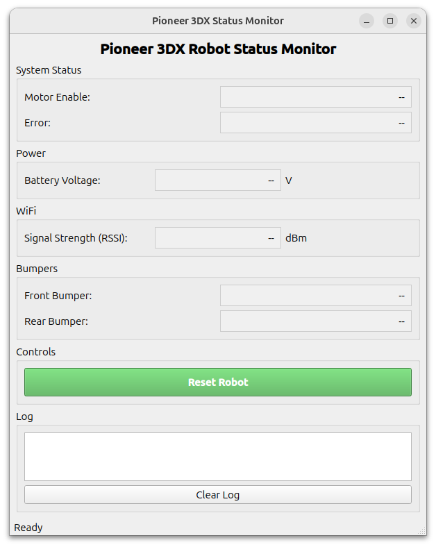
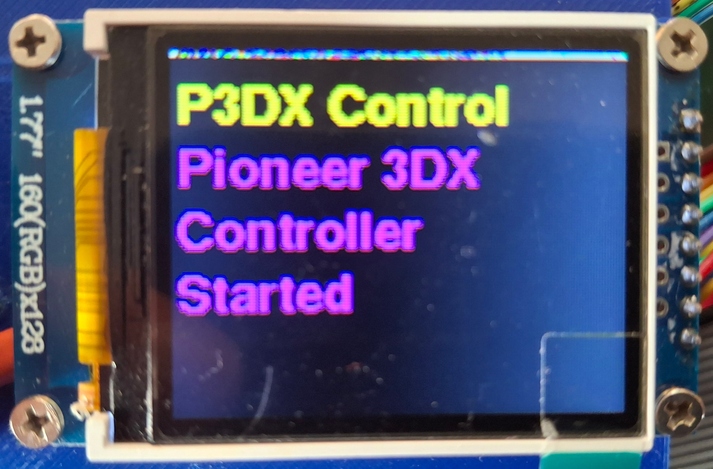
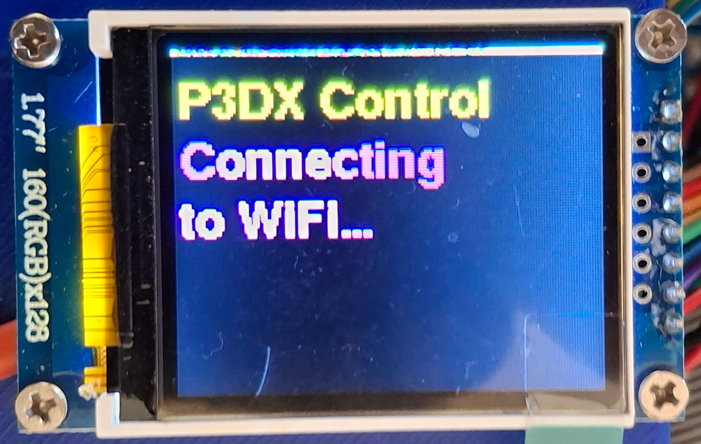
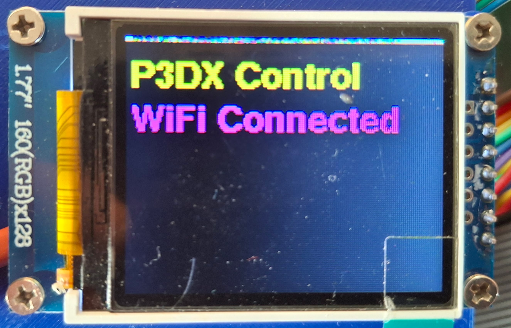
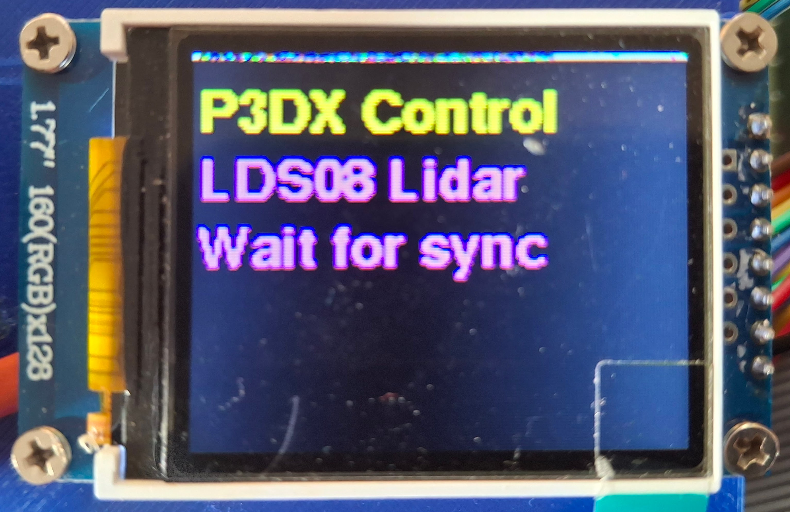
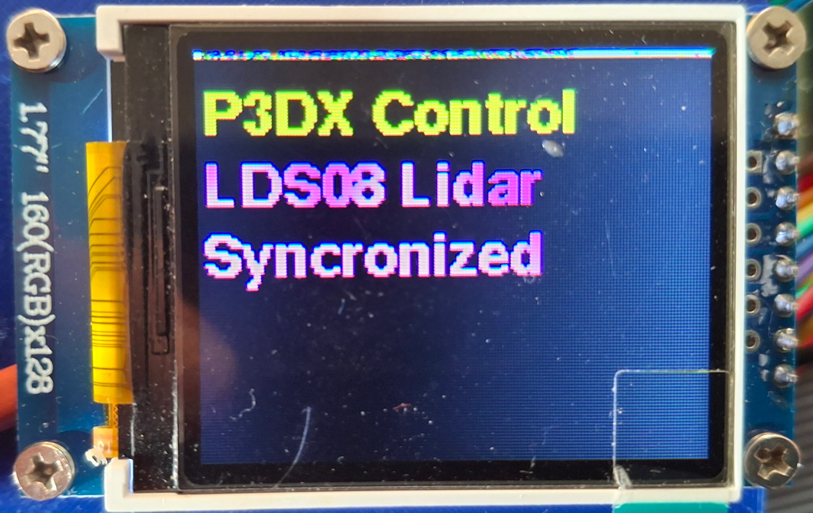
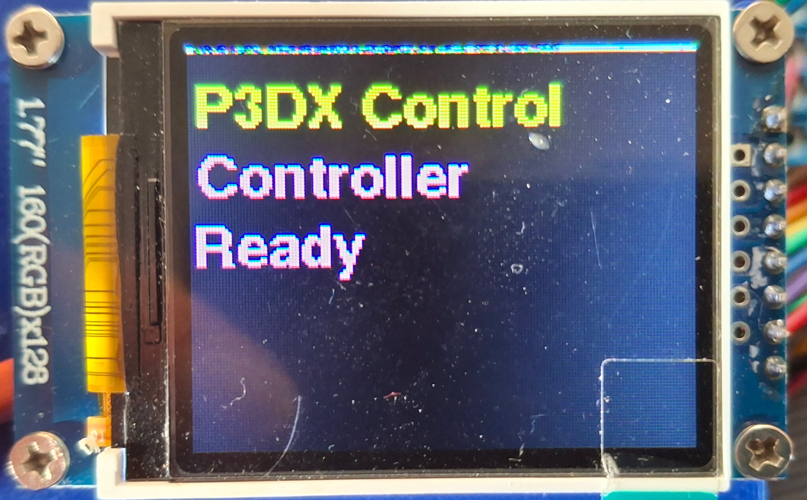
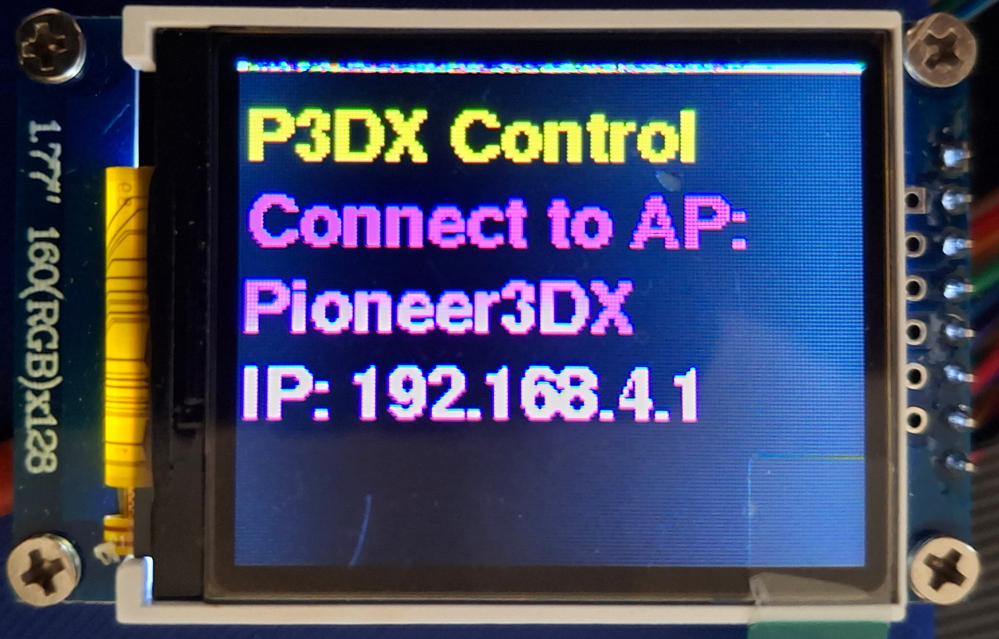
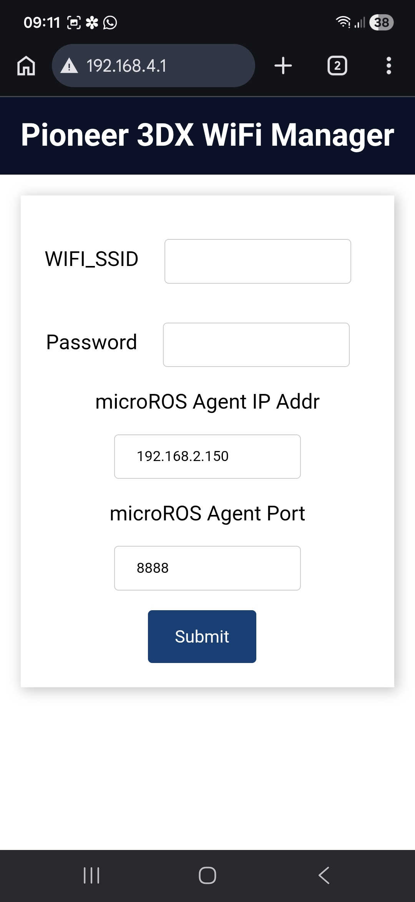
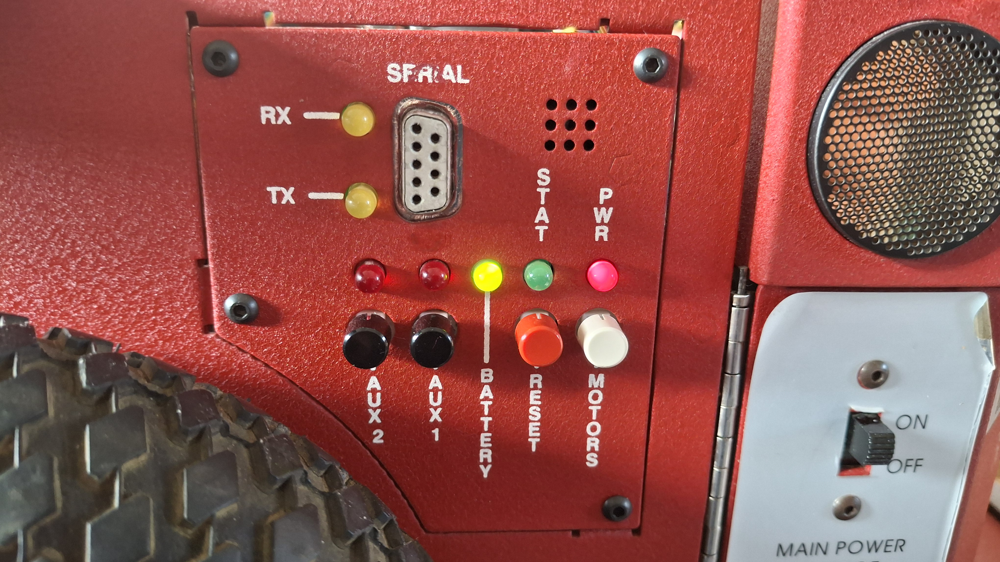

# Fysieke robot setup


## Starten van de micro-ROS agent en robot


### Doel
- Start de micro-ROS agent (serieel of UDP/TCP)
- Laadt de robotbeschrijving (URDF)
- Start de statusmonitor-module
- Start de robot_localization EKF-module

### Startargumenten
| Argument              | Standaard            | Beschrijving                                |
|----------------------|----------------------|---------------------------------------------|
| `base_serial_port`    | `/dev/ttyACM0`       | Seriële poort basisstation                  |
| `micro_ros_baudrate`  | `115200`             | micro-ROS baudrate                          |
| `micro_ros_transport` | `udp4`               | micro-ROS transport (serieel/udp4/tcp4)     |
| `micro_ros_port`      | `8888`               | micro-ROS UDP/TCP poortnummer               |
| `urdf`                | `<urdf pad>`         | Absoluut pad naar URDF-bestand robot        |
| `odom_topic`          | `/odom`              | EKF uitvoerodometrie-onderwerp              |

### Gestarte modules/acties
- **micro_ros_agent**: Start de micro-ROS agent voor communicatie met het robotbasisstation (serieel of netwerktransport).
- **robot_localization/ekf_node**: Voorziet sensorfusie voor odometrie.
- **p3dx_status_monitor**: Bewaakt robotstatus.
- **description.launch.py**: Laadt de robotbeschrijving en publiceert de robotstatus.

### Starten van de wifi micro-ROS agent en robot
```bash
ros2 launch p3dx_bringup bringup.launch.py
```
### Starten van de USB micro-ROS agent en robot
```bash
ros2 launch p3dx_bringup bringup.launch.py base_serial_port:=/dev/ttyUSB0 micro_ros_transport:=serieel
```
:::{note}
Kies 1 van bovenstaande commando's afhankelijk van hoe de robots is geconfigureerd (wifi of USB micro-ROS agent).
:::
### Statusmonitor
De statusmonitor-module geeft realtime feedback over de robotstatus, waaronder batterijspanning, verbindingsstatus en foutmeldingen. Dit is cruciaal voor het veilig en effectief bedienen van de robot, vooral tijdens teleoperatie of autonome taken.



### Startup sequence op de echte Pioneer 3DX robot
::::{grid} 2
:::{grid-item-card} 

:::
:::{grid-item-card} 

Deze sequentie wordt overgeslagen als de robot is geconfigreerd voor de USB micro-ROS agent.
:::
:::{grid-item-card}

Deze sequentie wordt overgeslagen als de robot is geconfigreerd voor de USB micro-ROS agent.

:::
:::{grid-item-card} 

:::
:::{grid-item-card}

:::
:::{grid-item-card}

:::
::::

### Wifi configuratie
Om de wifi micro-ROS agent te gebruiken, moet de robot verbonden zijn met hetzelfde netwerk als de computer waarop je werkt. Zorg ervoor dat de robot is geconfigureerd om verbinding te maken met het wifi-netwerk en dat je de juiste IP-adressen gebruikt in de micro-ROS agent en robotconfiguratie.

Als tijdens de startup-sequentie de robot niet kan verbinden met het wifi-netwerk, kan de wifi-configuratie geactiveerd worden. Op het display van de robot verschijnt de volgende melding:

Maak verbinding met het aangegeven Access Point (AP) en open een webbrowser om naar het aangegeven ip-adres te navigeren. Hier kun je de wifi-instellingen van de robot configureren, zoals het netwerk waarmee je wilt verbinden en het wachtwoord. Na het opslaan van de instellingen zal de robot herstarten en proberen verbinding te maken met het wifi-netwerk. Zodra de robot succesvol is verbonden, kun je de micro-ROS agent starten en de robot bedienen zoals beschreven in de documentatie.



:::{note}
Er kan ook een wifi setup geforceerd worden door de robot op te starten terwijl de `motors`-knop ingedrukt wordt gehouden terwijl de ` main power` wordt ingeschakeld. Dit kan handig zijn als de robot niet automatisch verbinding maakt met het netwerk of als je de wifi-instellingen wilt wijzigen.

:::

:::{tip}
Om het IP-adres van de computer waarop de micro-ROS agent draait te vinden, kun je het volgende commando gebruiken op een terminal op de robot:
```
ifconfig | grep broadcast
```
Let op: Dit commando werkt alleen goed als je met de computer  verbonden ben met het wifi-netwerk van je router.

:::