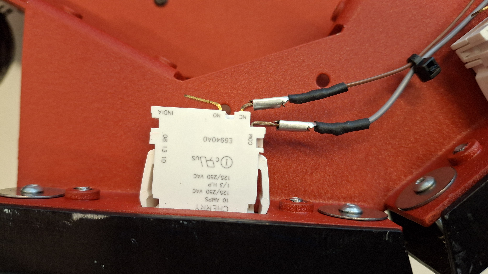
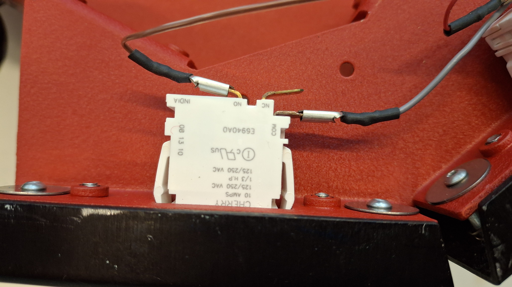

# Robot migratie

## Bouw van het processorbord

PCB Layout van het processorbord. De componenten zijn als volgt:
| Id | Designator | Quantity | Designation |
|---|---|---|---|
| 1 | C1,C2 | 2 | 100nF |
| 2 | U2 | 1 | TXS0108EPW |
| 3 | U4 | 1 | ~ |
| 4 | R6,R5,R1,R4 | 4 | DO NOT PLACE |
| 5 | J5 | 1 | Conn_01x03_Pin |
| 6 | J4 | 1 | Conn_01x16_Pin |
| 7 | CP2,CP1 | 2 | 100uF/10V |
| 8 | J2 | 1 | Conn_01x26_Pin |
| 9 | U3 | 1 | ESP32-S3-DevKitC |
| 10 | J3,J1 | 2 | Conn_01x10_Pin |
| 11 | J6 | 1 | Conn_01x05_Pin |
| 12 | R2,R3 | 1 | 100k |
| 14 | U1 | 1 | MPU6050 |

## Programmeren van de processor
### Wifi configuratie

### USB Configuratie

## Inbouwen van het processorbord

## Modificatie van de bumpers

::::{grid} 2
:::{grid-item-card} 

Voor modificatie
:::
:::{grid-item-card}

Na modificatie
:::
::::

## Testen van de migratie

## Lidar configurarties

:::::{card} 

::::{tab-set}

:::{tab-item} LDS-08 lidar

:::

:::{tab-item} YD-T-mini lidar

:::

::::

:::::

### Carriers
:::::{card} 

::::{tab-set}

:::{tab-item} p3dxControllerCarrier.FCStd

:::

:::{tab-item} LidarLds08DisplayCarrier.FCStd

:::

:::{tab-item} LidarYd_t_mini_DisplayCarrier.FCStd

:::

:::{tab-item} RaspberryPiPowerCarrier.FCStd

:::

::::

:::::
