# Robot migratie
Om de Pioneer 3DX geschikt te maken voor de ROS2 migratie, zijn er een aantal aanpassingen nodig. Deze aanpassingen zijn onderverdeeld in verschillende categorieën, zoals de bouw van het processorbord, het programmeren van de processor, het inbouwen van het processorbord, de modificatie van de bumpers en het testen van de migratie.

Uit de Pioneer 3DX robot wordt het oude processorbord verwijderd en vervangen door een nieuw processorbord dat is ontworpen om een ESP32-S3 device te integreren. De bumpers van de robot en het bedieningspaneel blijven behouden en worden opnieuw aangesloten op het nieuwe processorbord.

Er wordt een Lidar toegevoegd aan de robot, waarbij er twee opties zijn: de LDS-08 en de YD-T-mini.

## Bouw van het processorbord
In de directory `kiCad` van de Pioneer 3DX repostory is het ontwerp van het processorbord te vinden. Dit bord zal worden gebruikt om de ESP32-S3 device te integreren in de Pioneer 3DX en zal ook de nodige componenten bevatten voor de communicatie en voeding van de processor.

:::{note}
Je kunt het processorboard zelf laten produceren bij een PCB fabrikant zoals b.v. JLCPCB of PCBWay.
De eigendomsrechten van het ontwerp van het processorbord liggen bij Gerard Harkema/Avans Hogeschool. Het is niet toegestaan om het ontwerp te gebruiken voor commerciële doeleinden zonder toestemming van Gerard Harkema/Avans Hogeschool. Tevens dienen bij productie van het processorbord de volgende voorwaarden in acht te worden genomen:
* Het ontwerp van het processorbord mag alleen worden gebruikt voor educatieve doeleinden en niet voor commerciële doeleinden.
* Het ontwerp van het processorbord mag niet worden aangepast of gewijzigd zonder toestemming van Gerard Harkema/Avans Hogeschool.
* Bij productie van het processorbord dient de bronvermelding "Ontwerp van het processorbord is eigendom van Gerard Harkema/Avans Hogeschool" te worden opgenomen in de documentatie van het product.
:::

### Schema
Het schema van de nieuwe processorbord:
[Processorboard schema](./schematic.pdf)

### PCB
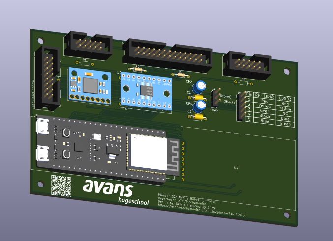


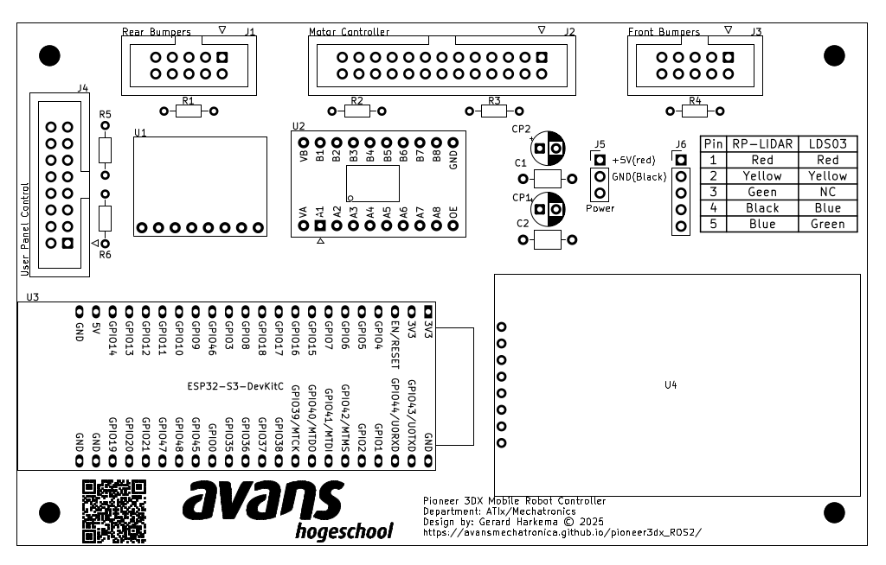
PCB Layout van het processorbord. De componenten zijn als volgt:
| Id | Designator | Quantity | Designation |
|---|---|---|---|
| 1 | C1,C2 | 2 | 100nF |
| 2 | U2 | 1 | TXS0108EPW |
| 3 | U4 | 1 | 1.77" TFT Display |
| 4 | R6,R5,R1,R4 | 4 | DO NOT PLACE |
| 5 | J5 | 1 | Conn_01x03_Pin |
| 6 | J4 | 1 | Conn_01x16_Pin |
| 7 | CP2,CP1 | 2 | 100uF/10V |
| 8 | J2 | 1 | Conn_01x26_Pin |
| 9 | U3 | 1 | ESP32-S3-DevKitC |
| 10 | J3,J1 | 2 | Conn_01x10_Pin |
| 11 | J6 | 1 | Conn_01x05_Pin |
| 12 | R2,R3 | 1 | 100k |
| 14 | U1 | 1 | MPU6050 |

:::{warning}
Gebruik alleen een originele ESP32-S3-DevKitC van Espressif. Er zijn veel namaak ESP32-S3 boards op de markt die mogelijk niet correct functioneren. Bekend issue met namaak ESP32-S3 dat het LiteFS bestandssysteem niet correct functioneert, wat kan leiden tot problemen met het opslaan van de wifi configuratie.
:::

## Programmeren van de processor
In de directory ` ESP32/ros_controller` van de Pioneer 3DX repository is de code te vinden die op de ESP32-S3 device moet worden geprogrammeerd. Deze code is verantwoordelijk voor het aansturen van de robot en het communiceren met de ROS2 nodes. Je kunt deze code uploaden naar de ESP32-S3 met Visual Studio Code en de PlatformIO extension. 


:::::{card} 

::::{tab-set}

:::{tab-item} Wifi configuratie

Selecteer in Visual Studio Code de `esp32-s3-wroom-wifi` environment.

**Upload Filesystem image**

Om de wifi configuratie op te slaan, moet er een filesystem image worden geüpload naar de ESP32-S3 device. Dit kan worden gedaan met de volgende commando's in de terminal van Visual Studio Code:
```bash
cd ESP32/ros_controller
pio run --target uploadfs -e esp32-s3-wroom-wifi
```

**Upload firmware**
Om de firmware te uploaden naar de ESP32-S3 device, kan het volgende commando worden gebruikt in de terminal van Visual Studio Code:
```bash
cd ESP32/ros_controller
pio run --target upload -e esp32-s3-wroom-wifi
```

:::

:::{tab-item} USB Configuratie

Selecteer in Visual Studio Code de `esp32-s3-wroom-usb` environment.

**Upload firmware**

Om de firmware te uploaden naar de ESP32-S3 device, kan het volgende commando worden gebruikt in de terminal van Visual Studio Code:
```bash
cd ESP32/ros_controller
pio run --target upload -e esp32-s3-wroom-usb
```

:::

::::

:::::


:::{note}
In de `build_flags` sectie van de geselecteerde environment kan er geslecteerd worden welk type Lidar er wordt gebruikt. Standaard is dit ingesteld op de YD-T-mini, maar dit kan worden aangepast naar de LDS-08 door de juiste environment te wijzigen:
```ini
build_flags = 
; Enable WiFi
  -DWIFI 
; Enable WiFi config debug
  -DNETWORK_CONFIG_DEBUG
; Enable native USB CDC serial on ESP32-S3, do not change this when using WiFi transport for micro-ROS 
  -DARDUINO_USB_MODE=1
  -DARDUINO_USB_CDC_ON_BOOT=1
; Enable TFT print for WiFi status
  -DWIFI_INCLUDE_TFT_PRINT
; Enable general debugging
;  -DDEBUG 
; Enable motor controller debug
;  -DDEBUG_MOTOR_CONTROLLER 
; Detach encoder interrupts during critical sections to prevent issues with the ESP32-S3's USB CDC implementation, use with caution as it may cause missed encoder ticks
; -DDE_ATTACH_ENCODER_INTERRUPTS
; Enable multiple executors for publishers
  -DMULTIPLE_PUBLISH_EXECUTORS
; Enable bumper handling 
  -DHANDLE_BUMPERS 
; Enable LIDAR
  -DINCLUDE_LIDAR
; Lidar type, choose one of the following based on your hardware
;  -DLIDAR_LDS08
; LIDAR angle offset for LDS-08, adjust as needed for your specific mounting orientation
;  -DLIDAR_ANGLE_OFFSET=-90 
; Invert LIDAR scan for LDS-08, adjust as needed based on your specific mounting orientation and desired scan direction
;  -DLIDAR_INVERT_SCAN 
  -DLIDAR_YD_T_MINI
; LiDAR angle offset for YDLIDAR T-mini Plus, adjust as needed for your specific mounting orientation
  -DLIDAR_ANGLE_OFFSET=180
; Invert LIDAR scan for YDLIDAR T-mini Plus, adjust as needed based on your specific mounting orientation and desired scan direction  
  -DLIDAR_INVERT_SCAN 
; Enable LIDAR debug
  -DDEBUG_LIDAR
; Set core debug level to maximum
 -DCORE_DEBUG_LEVEL=3
; Enable IMU not tested yet, use with caution
;  -DINCLUDE_IMU 
; Enable IMU debug
;  -DDEBUG_IMU
; Enable IMU acquisition debug
;  -DDEBUG_IMU_AQUISITION

```
:::

## Inbouwen van het processorbord
:::{danger}
Verwijder de batterij uit de robot voordat je begint met het inbouwen van het processorbord. Dit is belangrijk om schade aan de componenten te voorkomen en om veilig te kunnen werken aan de robot.
:::

Verwijder het oude processorbord uit de Pioneer 3DX robot en installeer het nieuwe processorbord. Gebruik hiervoor de verderop beschreven carrier.
* Sluit de motordriver-board aan op de J2 connector van het processorbord.
* Sluit de front-bumpers aan op de J3 connector van het processorbord.
* Sluit de rear-bumpers aan op de J1 connector van het processorbord.
* Sluit het digital display aan op de U4 connector van het processorbord (gebruik hiervoor bandkabel).
* Sluit de Lidar aan op de J6 connector van het processorbord.(zie verderop voor de verschillende Lidar carriers)
* Sluit de voeding van het motordriver-board aan op de J5 connector van het processorbord.
    * Verwijder de gele draad van de voeding uit het motordriver-board.
    * Let op dat de bedrading van de voeding correct is.
* Sluit het bedieningspaneel aan op de J4 connector van het processorbord.

## Voorbeeld van de bedrading
In de volgende afbeeldingen is te zien hoe het processorbord is ingebouwd in de Pioneer 3DX robot en hoe de verschillende componenten zijn aangesloten.
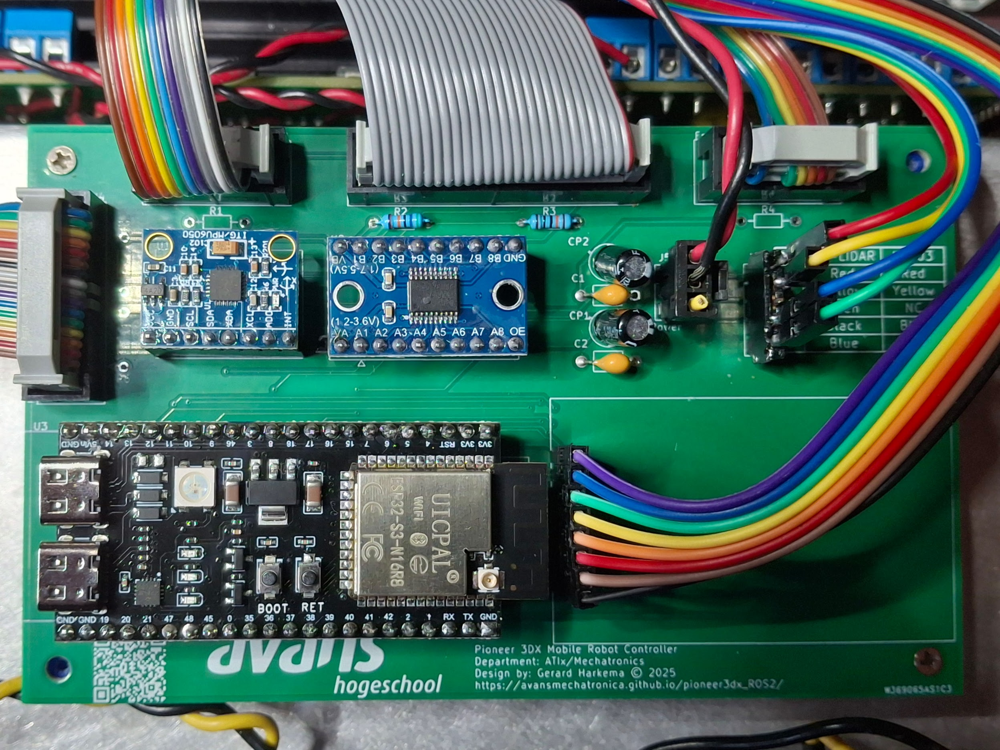

## Modificatie van de bumpers
Orgineel zijn de bumpers van de Pioneer 3DX robot geconfigureerd in een wired active-high `AND` configuratie. Voor de ROS2 migratie is het nodig om deze te modificeren naar een active-low `AND` configuratie.

* Verwijder de 4 schroeven net boven de bumpers. Hierdoor komt de beschermingskap aan de onderkant van de robot los. 
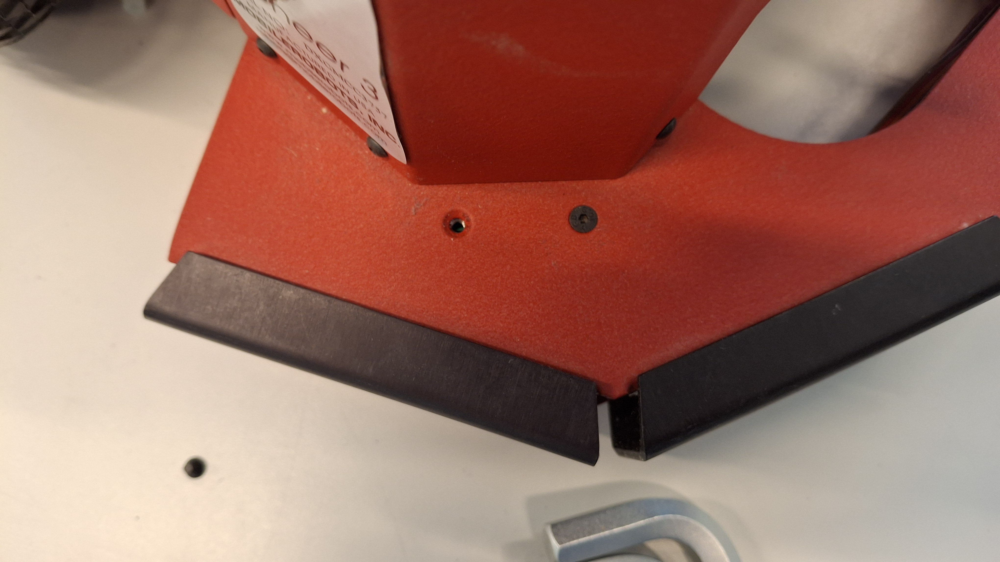

*Draai de robot op zijn kop en onderstaande aansluitingen worden zichtbaar.
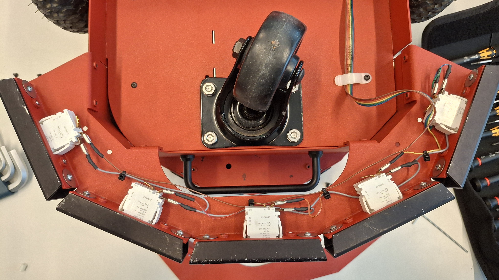

*Verplaats de draden van iedere micro-switch de `NC`-aansluiting naar de `NO`-aansluiting. Hierdoor worden de bumpers geconfigureerd in een active-low configuratie.
Laat de `COM`-aansluiting ongemoeid.

:::{grid-item-card} 
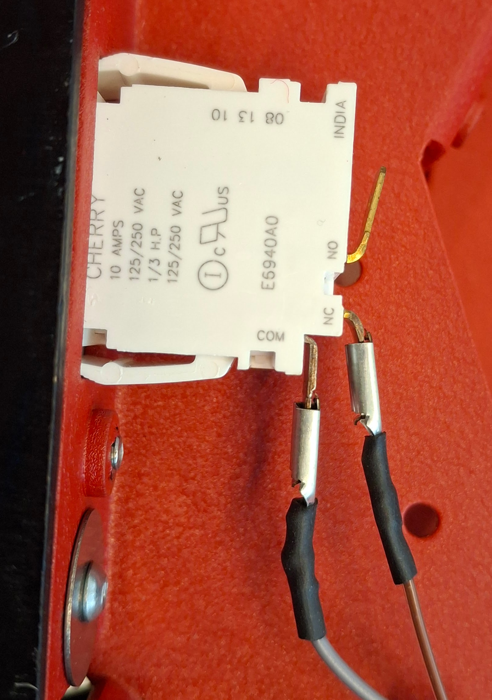
Voor modificatie
:::
:::{grid-item-card}
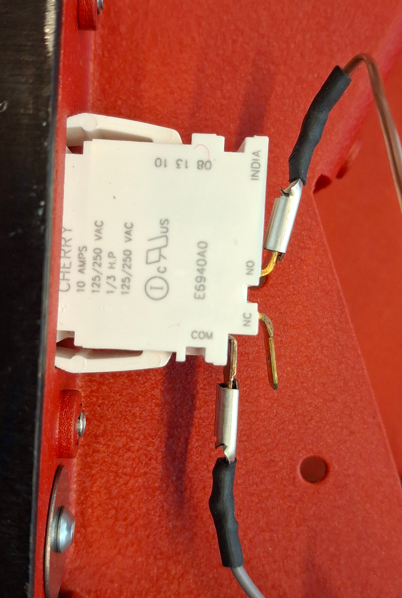
Na modificatie
:::
::::

* Monteer de beschermingskap weer terug op de robot en draai de 4 schroeven weer vast.

* Herhaal bovenstaande stappen voor zowel de front-bumpers als de rear-bumpers.


## Lidar configurarties
Er zijn twee verschillende Lidar opties beschikbaar voor de Pioneer 3DX robot: de LDS-08 en de YD-T-mini. Beide Lidar's kunnen worden geïntegreerd met het nieuwe processorbord en bieden verschillende functies en prestaties.

Voordat je de lidar aan kun sluiten dien je de draden van de lidar te verlengen zodat deze bij de J6 connector van het processorbord kunnen worden aangesloten. Gebruik voor de verleng draden dezelfde kleur codering als de originele draden van de lidar om verwarring te voorkomen. Sluit vervolgens de verlengde draden aan op de J6 connector van het processorbord volgens schema.

:::::{card} 


::::{tab-set}

:::{tab-item} LDS-08 lidar
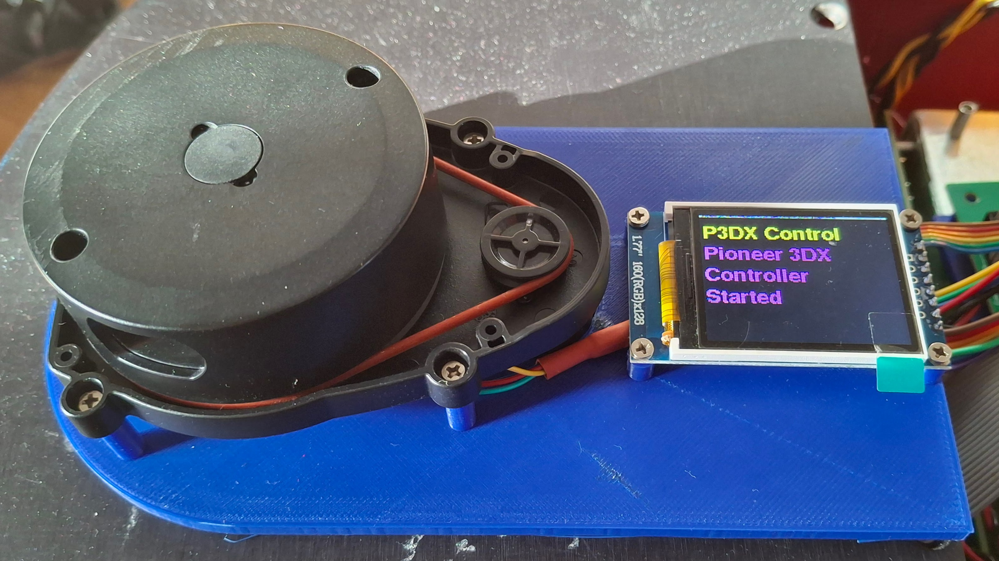

| J6 connector pin | Signaal | kleur
|---|---|---|
| 1 | VCC | Rood |
| 2 | TX | Geel |
| 3 | RX | NC |
| 4 | GND | Blauw |
| 5 | Motor | Groen |
:::

:::{tab-item} YD-T-mini lidar
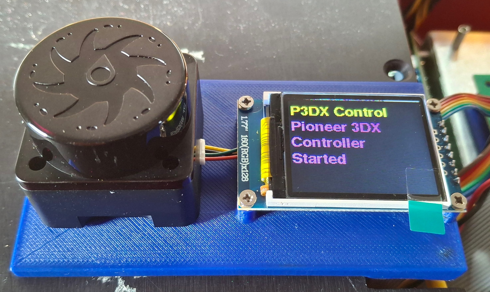

| J6 connector pin | Signaal | kleur
|---|---|---|
| 1 | VCC | Rood |
| 2 | TX | Groen |
| 3 | RX | Geel |
| 4 | GND | Zwart |
| 5 | Motor | NC |
:::
:::

::::

:::::

## Carriers
Voor de diverse onderdelen van de robot zijn er carriers ontworpen om de verschillende componenten netjes te kunnen monteren en aansluiten op het processorbord. Deze carriers zijn ontworpen in FreeCAD. De bestanden van de carriers zijn te vinden in de directory `freecad` van de Pioneer 3DX repository. De carriers zijn te exporteren naar verschillende formaten voor productie of 3D-printen. Hieronder is een overzicht van de verschillende carriers.

:::::{card} 


::::{tab-set}

:::{tab-item} p3dxControllerCarrier.FCStd
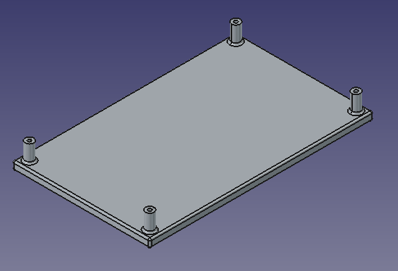

:::

:::{tab-item} LidarLds08DisplayCarrier.FCStd
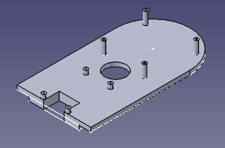


:::

:::{tab-item} LidarYd_t_mini_DisplayCarrier.FCStd
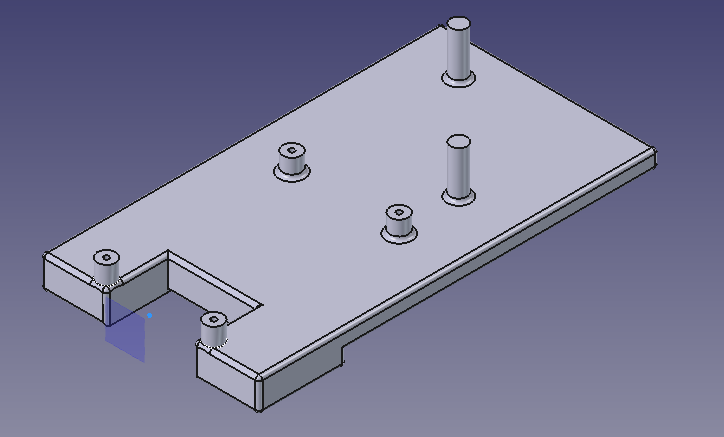


:::

:::{tab-item} RaspberryPiPowerCarrier.FCStd
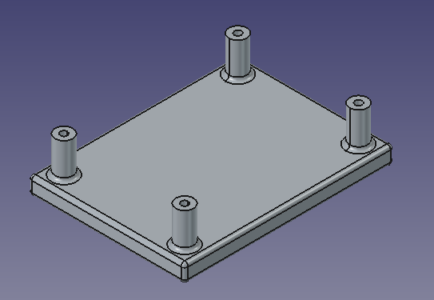


:::

::::

:::::

## Testen van de migratie
Controleer of alle componenten correct zijn aangesloten en of de firmware correct is geüpload naar de ESP32-S3 device. Plaats de batterij terug in de robot en zet de robot aan. Controleer of de robot correct functioneert door de berichten op het display te bekijken.

Start vervolgens de ROS2 nodes op en controleer of de robot correct communiceert met de ROS2 nodes.
Zie [Fysieke robot setup](real_robot_setup.md) voor meer informatie over het starten van de ROS2 nodes en het controleren van de robotstatus.