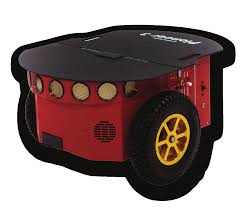
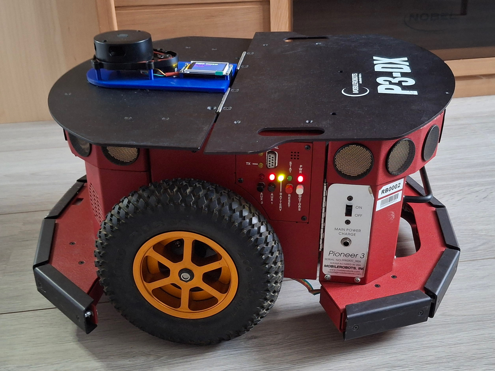
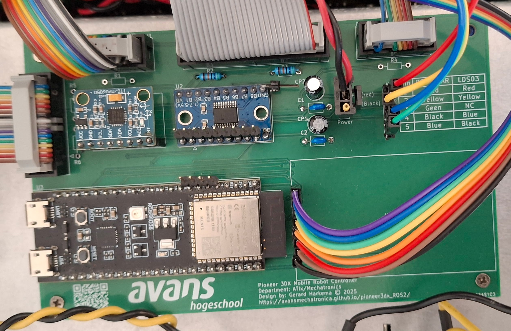

# Inleiding

Originele Pioneer P3DX robot

In deze documentatie wordt beschreven hoe een Pioneer 3DX robot (aangeduid als P3DX-robot), een ontwerp uit 2007, kan worden omgebouwd tot een robot die geschikt is om te besturen met het ROS2 jazzy systeem.
De basis is hiervoor een nieuw processorbord gebaseerd op een ESP32-S3-N16R8 processor 

De P3DX-robot heeft de volgende eigenschappen:
* Bestaand processorboard is vervangen door nieuw processorboard gebaseerd op een ESP32-S3-N16R8 processor
* 1.77" status display
* Beperkte functionaliteit van het bestaande controle paneel.
* De P3DX-robot communiceert met host-computer d.m.v. een MicroROS agent gebruik makend van 1 de volgende twee MicroROS protocollen
    * Serial
    * Wifi  
* Besturen met een z.g.n. cmd_vel topic (twist.geometry_msgs.msg)
* Op de robot zijn de volgende sensoren aanwezig:
    * Lidar, topic /scan
    * Imu, topic /imu
    * Odometer, topics /odom/unfiltered & /odom/filtered
    * Bumpers, topics /p3dx/status
* De robot kan worden gereset met het /p3dx/reset (bool) topic.
* Een grafische user interface is voor raadplegen status en resetten van de p3dx-robot 

Gemodificeerde P3DX-robot met lidar en 1.77" status display.

::::{grid} 2
:::{grid-item-card} 

Met LDS08 lidar
:::
:::{grid-item-card}

Met YD-T mini lidar
:::
::::

Nieuw processorboard gebaseerd op een ESP32-S3-N16R8 processor.

In deze documentatie worden de benodigde stappen, configuraties en voorbeeldcommando's beschreven om de robot in gebruik te nemen met ROS2 Jazzy.

Tevens wordt beschreven hoe een bestaande robot kan worden omgebouwd. Alle tekeningen en bijbehorende documentatie zijn beschikbaar in de [github repository](https://github.com/AvansMechatronica/pioneer3dx_ROS2).
